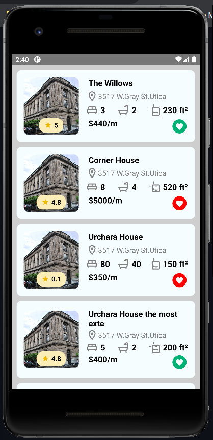

# React Native Examples
<blockquote>
👉 This repository contains most of the examples I've created on React Native.
You may find some of the examples being outdated in time, in terms of framework updates or libraries. Don't worry the concept would be the same.
</blockquote>

## Custom Card Using Styled Components in React Native

- 🐙 [Repo](https://github.com/GerardoTovar/Examples-React-Gerardo/tree/main/CustomCard)

This example uses:
- React Native `0.68.2`
- [styled components 5.3.5](https://www.npmjs.com/package/styled-components)
- [React Navigation Stack 6.6.2](https://reactnavigation.org/docs/getting-started)
- [Vector Icons 6.6.2](https://www.npmjs.com/package/react-native-vector-icons)

