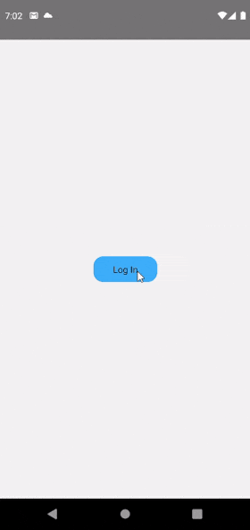
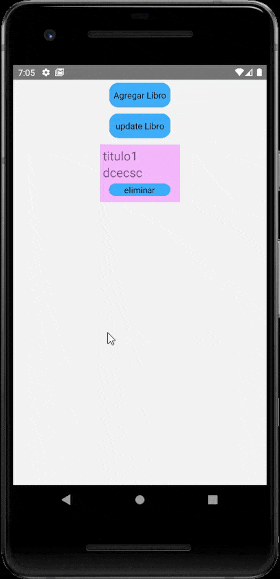
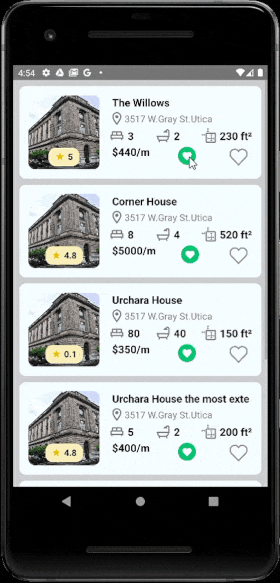
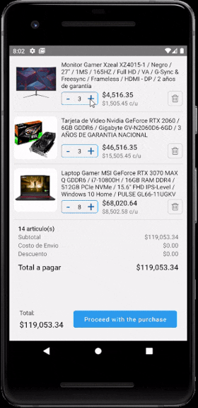
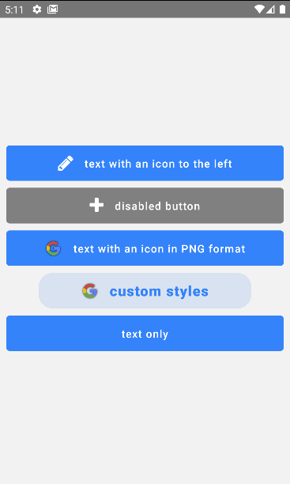
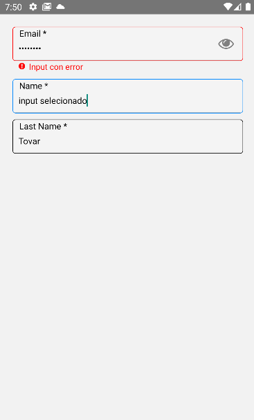

# React Native Examples
<blockquote>
👉 This repository contains most of the examples I've created on React Native.
You may find some of the examples being outdated in time, in terms of framework updates or libraries. Don't worry the concept would be the same.
</blockquote>

## Custom Modal Using ActivityIndicator as a Component hook in React Native

- 🐙 [Repo](https://github.com/GerardoTovar/Examples-React-Gerardo/tree/main/BusyIndicator)

This example uses:
- React Native `0.71.2`
- [React Navigation Stack 6.9.9](https://reactnavigation.org/docs/getting-started)
- **Description**: A modal was used to cover the whole screen, 
inside the modal it has an ActivityIndicator, so you can customize everything

## Custom Modal Using Rive as a Component hook in React Native

- 🐙 [Repo](https://github.com/GerardoTovar/Examples-React-Gerardo/tree/main/BusyIndicatorRive)

This example uses:
- React Native `0.70.4`
- [React Navigation Stack 6.9.1](https://reactnavigation.org/docs/getting-started)
- [rive-react-native 3.0.41](https://github.com/rive-app/rive-react-native)
- [rive Community](https://rive.app/community/)
- [rive quick-start](https://help.rive.app/runtimes/quick-start)
- [rive android Doc](https://github.com/rive-app/rive-android)
- **Description**: A modal was used to cover the whole screen, 
inside the modal it has an Rive, you can call different methods depending 
on the animation you want to show

## Simple Example MongoDB CRUD ES6+

- 🐙 [Repo](https://github.com/GerardoTovar/Examples-React-Gerardo/tree/main/RnMongoCRUD1)

This example uses:
- React Native `0.68.2`
- [React Navigation Stack 6.6.2](https://reactnavigation.org/docs/getting-started)
- **Description**: It is just an example of how to implement mongodb CRUD, the backend is in ES6+

## Custom Card Using Styled Components and lottie in React Native

- 🐙 [Repo](https://github.com/GerardoTovar/Examples-React-Gerardo/tree/main/RnLottieAnimation)

This example uses:
- React Native `0.70.5`
- [styled components 5.3.6](https://www.npmjs.com/package/styled-components)
- [React Navigation Stack 6.9.1](https://reactnavigation.org/docs/getting-started)
- [Vector Icons 9.2.0](https://www.npmjs.com/package/react-native-vector-icons)
- [lottie 5.1.4](https://github.com/lottie-react-native/lottie-react-native)
- **Description**: I put two buttons, one is an icon button, and the other is a lottie button.

## example of zustand (shopping cart)

- 🐙 [Repo](https://github.com/GerardoTovar/Examples-React-Gerardo/tree/main/RnZustand)

This example uses:
- React Native `0.70.5`
- [React async-storage 1.17.10](https://www.npmjs.com/package/@react-native-async-storage/async-storage)
- [zustand 4.1.4](https://www.npmjs.com/package/zustand)
- [react bounceable 1.0.3](https://www.npmjs.com/package/@freakycoder/react-native-bounceable)
- [React Navigation Stack 6.9.1](https://reactnavigation.org/docs/getting-started)
- [Vector Icons 9.2.0](https://www.npmjs.com/package/react-native-vector-icons)
- **Description**: custom components are used for counter, buttons. everything else is using a flat list

## example of Buttons

- 🐙 [Repo](https://github.com/GerardoTovar/Examples-React-Gerardo/tree/main/CustomButton)

This example uses:
- React Native `0.70.5`
- [React Navigation Stack 6.9.1](https://reactnavigation.org/docs/getting-started)
- [Vector Icons 9.2.0](https://www.npmjs.com/package/react-native-vector-icons)
- **Description**: is a button component which is highly customizable to receive different icons, images or styles

## example of Input

- 🐙 [Repo](https://github.com/GerardoTovar/Examples-React-Gerardo/tree/main/CustomInput)

This example uses:
- React Native `0.70.5`
- [React Navigation Stack 6.9.1](https://reactnavigation.org/docs/getting-started)
- [Vector Icons 9.2.0](https://www.npmjs.com/package/react-native-vector-icons)
- [react-native-awesome-text-input 1.1.5](https://www.npmjs.com/package/react-native-awesome-text-input)
- **Description**: is a Input component which is highly customizable to receive different styles

